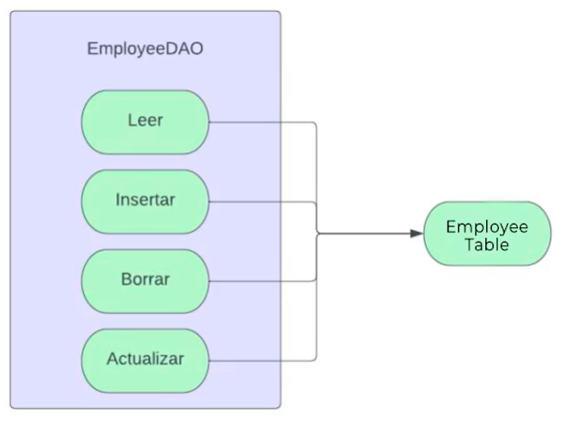
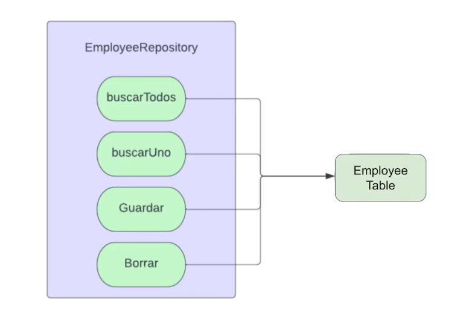

# JDBC-JAVA

1. Formas implementando el jar directamente en el proyecto
2. Implementar maven, para el manejo de dependencias con el pom

    Tipo de patron DAO (data access object)

    - Separa la lógica de acceso a datos de la lógica de negocios
    - el DAO proporcionará los métodos necesarios para el crud
- 

  Tipo de patron repository

    -  Abstraer y encapsular el acceso de datos
    -  Proporciona una capa de negocio y persistencia de datos
- 

Se debe crear la base de datos

Se debe crear la siguiente tabla:

CREATE TABLE Employee (
id INT PRIMARY KEY,
firstName VARCHAR(255),
firstSurname VARCHAR(255),
secondSurname VARCHAR(255),
email VARCHAR(255),
salary FLOAT
);

agregamos datos:

INSERT INTO Employee (id, firstName, firstSurname, secondSurname, email, salary) VALUES
(1, 'Juan', 'Pérez', 'González', 'juan.perez@example.com', 30000.00),
(2, 'Ana', 'Martínez', 'López', 'ana.martinez@example.com', 32000.00),
(3, 'Carlos', 'Jiménez', 'Ruiz', 'carlos.jimenez@example.com', 35000.00),
(4, 'Sofía', 'Fernández', 'Moreno', 'sofia.fernandez@example.com', 30500.00),
(5, 'David', 'García', 'Santos', 'david.garcia@example.com', 31000.00),
(6, 'Marta', 'Rodríguez', 'Vázquez', 'marta.rodriguez@example.com', 33000.00),
(7, 'Luis', 'López', 'Torres', 'luis.lopez@example.com', 34000.00),
(8, 'Lucía', 'Sánchez', 'Romero', 'lucia.sanchez@example.com', 31500.00),
(9, 'Javier', 'Díaz', 'Navarro', 'javier.diaz@example.com', 32500.00),
(10, 'María', 'Moreno', 'Gutiérrez', 'maria.moreno@example.com', 33500.00);
